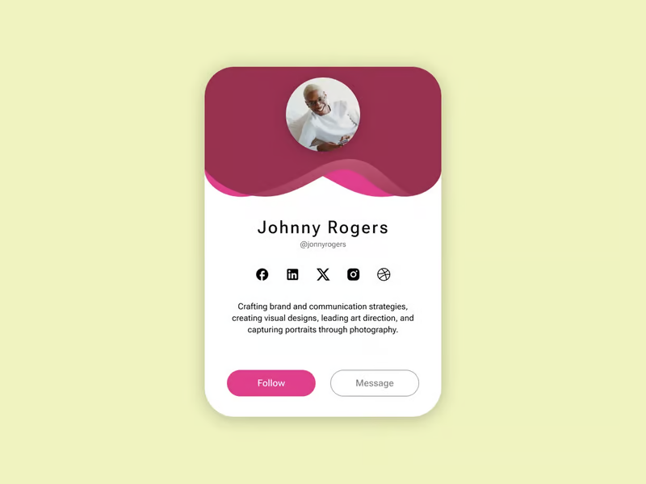
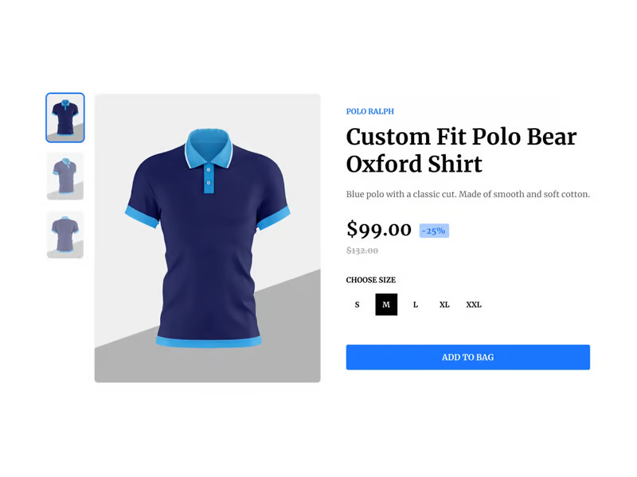

# Introduction
[100 FREE Frontend Challenges](https://dev.to/bigsondev/100-free-frontend-challenges-3f0?ref=dailydev)

In the spirit of building strong habits and the #100DaysOfCode idea, we decided to make our list of beautifully crafted "Design To Code" challenges publicly available, where each day you work on recreating (with your variation of course!) the original design screenshot to make it a working website/web app.

The goal is to reflect the provided design with HTML & CSS. If you want to dive deeper, adding interactivity via JS or any frameworks, libraries, or tools is more than encouraged. Maybe you can even create your next micro-SaaS out of it, who knows?

I hope you'll complete all 100 of them and land your dream job as a Web Dev! 🫡

# 1. Profile Card
****

It is a perfect challenge for practicing Flexbox and improving your CSS skills.

# 2. Add to Bag

Enhance your interactive design skills by creating a dynamic shopping cart experience.

# 3. Mobile Navigation
Image description

Focus on responsive design and user-friendly mobile navigation solutions.

4. Contact Us
Image description

Learn to design an accessible and user-centric contact form for better customer interaction.

5. Recipe
Image description

Craft a delightful recipe display to enhance readability and user engagement.

6. Image Carousel
Image description

Develop an image carousel to understand handling user interactions and transitions.

7. Create Account
Image description

Build a user-friendly account creation interface with validations to improve form handling.

8. Music Events
Image description

Create a vibrant interface for displaying music events that captivate and inform.

9. Password Generator
Image description

Implement a password generator to practice generating and handling secure user data.

10. Sign-up Page
Image description

Develop a sign-up page to refine form layout and design, focusing on user experience.

11. Hotel Booking
Image description

Design a streamlined hotel booking interface that offers a seamless booking experience.

12. Restaurant Reservation
Image description

Create a restaurant card with an image, description, reviews, and a clear call-to-action button.

13. Task Board
Image description

Build a task management board that helps users organize projects and daily activities.

14. Shopping List
Image description

Create an interactive shopping list with order summary, and promo code sections.

15. Notifications
Image description

Implement a notification system with different types of notifications and an empty state without any of them.

16. Fur Friends
Image description

Craft an engaging list for pet lovers to explore pets with a pet details card.

17. Article Slider
Image description

Implement an article slider that highlights featured stories with smooth navigation.

18. Images Preview
Image description

Craft a gallery app that allows users to preview images in different layouts.

19. Upload Images
Image description

Create an image upload interface that supports drag-and-drop functionality and previews.

20. Card Wallet
Image description

Develop a digital wallet interface that displays user cards, and card transactions and allows adding a new card.

21. Pricing Plans
Image description

Design a clear and concise pricing plan interface that helps users choose the right option.

22. Messages
Image description

Build a messaging app interface that supports a conversations list and individual 1-1 message view.

23. Home Page
Image description

Create a captivating homepage that draws visitors in and guides them through beautiful plants.

24. Movie Ticket
Image description

Develop a movie ticket interface that allows users to buy tickets and choose seats.

25. Meeting Schedule
Image description

Create a scheduling app that helps users plan and coordinate meetings effectively.

26. Job Board
Image description

Create a job board that is intuitive for users looking for career opportunities.

27. Leaderboards
Image description

Build a leaderboard interface that dynamically displays user rankings and scores from today to year categories.

28. Playlist
Image description

Implement a music playlist interface that allows opening a pop-up with the current song.

29. Video Player
Image description

Create a custom video player that supports various media formats and user interactions.

30. Invoices
Image description

Implement an invoice interface that helps users manage billing and track payments efficiently.

31. Dashboard
Image description

Build a comprehensive dashboard that provides users with insights and data visualizations.

32. Newsletter
Image description

Create a newsletter sign-up page that captures user interest with an attractive design.

33. Brand Visualizer
Image description

Develop a tool to create and preview brand elements like color schemes.

34. User Profile
Image description

Design a user profile dropdown menu with various menu items.

35. Rate Us
Image description

Create a feedback form to rate users' experiences and provide valuable insights via emojis.

36. Sleep App
Image description

Design a sleep-tracking app that offers insights into sleep patterns and tips for improvement.

37. Explore Flights
Image description

Create a complex flight search filter bar.

38. Music Festival
Image description

Build a festival home page with navigation and an engaging hero section.

39. QR Code Scanner
Image description

Implement a QR code scanner that enhances user interaction with quick scanning features.

40. FAQ
Image description

Create a FAQ section that provides clear and helpful answers to common customer questions via the accordion component.

41. Create Workspace
Image description

Design a virtual workspace creator that allows users to customize their digital work environment.

42. Settings Appearance
Image description

Build a settings page that lets users customize the appearance of their application interface.

43. Player Profile
Image description

Design a player profile for sports apps that showcases player stats, career highlights, and more.

44. Website Launch
Image description

Create a launch page with a countdown timer.

45. Hosting Features
Image description

Build a hosting service feature page that explains the benefits and packages available.

46. Customer List
Image description

Develop a customer management table that helps to organize users and contains relevant actions.

47. Export File
Image description

Design a file export interface that supports multiple formats and includes customizable settings.

48. Markdown Post
Image description

Create a markdown-based component that supports bold, italic, and underlined text and has a mention user feature.

49. App Navigation
Image description

Build an app navigation menu for desktop and mobile devices.

50. Friend Request
Image description

Design a social network feature that manages friend requests and user interactions.

51. Download App
Image description

Create a download page for apps that includes clear installation instructions.

52. Language App
Image description

Develop a language learning app that includes lessons, leaderboards, and interactive content.

53. Billing Page
Image description

Design a billing page that is user-friendly and makes it easy to view subscriptions, payment methods, and billing history.

54. Article Summary
Image description

Create a summary card of the article with images, user info, and relevant stats.

55. Progress Bars
Image description

Design engaging and informative progress bars for applications that track user progress.

56. Project Roadmap
Image description

Build a project management tool that visualizes roadmaps and tracks milestones.

57. Game Profile
Image description

Design a game profile interface that displays player achievements, game stats, and badges.

58. Create Task
Image description

Develop a task creation form that simplifies project management and collaboration.

59. Calculate Tip
Image description

Create a tip calculator app that helps users quickly figure out the appropriate tip amount.

60. Code Verification
Image description

Design a code verification component.

61. Flight Ticket
Image description

Build a flight ticket card preview that includes information and a QR code.

62. Testimonials
Image description

Design a testimonials section that showcases user feedback and builds trust with potential clients.

63. Weather App
Image description

Develop a weather app that provides accurate forecasts, and weather-related news.

64. Document Manager
Image description

Create a blog-like tool where users can add new documents, and chapters, delete, and preview them.

65. Interests
Image description

Design a user interest card that allows users to select their interests.

66. Navigation UI
Image description

Build a dynamic navigation UI that adjusts to user preferences and highlights key areas.

67. Select Account
Image description

Create an account selection page of who's watching.

68. User Satisfaction
Image description

Develop a user satisfaction survey that collects meaningful feedback on user experience.

69. Profile Settings
Image description

Design a comprehensive profile settings page that allows users to manage their personal information.

70. Cookies Banner
Image description

Create a cookies consent banner that is compliant with data protection regulations and user-friendly.

71. Email Client
Image description

Build an email client interface that supports organizing, reading, and composing emails efficiently.

72. Image Collections
Image description

Develop an application that organizes images into collections and offers tagging features.

73. Push Notification
Image description

Design a push notification component.

74. Manage Accounts
Image description

Create an account management page that provides a clear overview of user accounts.

75. Add Shot
Image description

Develop a modal that allows to add a shot to a collection.

76. E-book Store
Image description

Design an e-book store website that offers seamless browsing for users.

77. App Integrations
Image description

Create an interface that facilitates easy integration of various apps and services.

78. Audio Player
Image description

Develop a simple audio player.

79. Payment Plan
Image description

Design a payment plan interface that provides users with flexible payment options and clear information.

80. Articles Grid
Image description

Build a grid layout for articles that enhances readability and user engagement.

81. Delivery Details
Image description

Create a delivery details card that ensures information accuracy and enhances user trust.

82. Color Palette
Image description

Develop a tool for designers to create and save custom color palettes.

83. Socials Share
Image description

Design a social media sharing component.

84. Buy a Coffee
Image description

Create a donation page that encourages users to support content creators through small contributions.

85. Customer Reviews
Image description

Develop a customer review card that fosters transparency and helps other users make informed decisions.

86. Chatbot
Image description

Build a chatbot that can guide users through your website and answer frequently asked questions.

87. Charts
Image description

Design a series of interactive charts that display data in a clear and engaging manner.

88. Fingerprint
Image description

Create a feature that utilizes fingerprint scanning or log-in via PIN.

89. Voice Call
Image description

Develop a voice call card that ensures clarity and reliability during calls.

90. My Devices
Image description

Design a card that allows users to manage and monitor all their connected devices.

91. Quiz App
Image description

Build a quiz app that offers a variety of questions and tracks user progress.

92. Search Filters
Image description

Develop search filters that help users find exactly what they're looking for with ease.

93. Task Manager
Image description

Create a task manager that helps users organize their daily tasks and deadlines.

94. Time Widget
Image description

Design a time widget that offers various clock functionalities and customization options.

95. 404
Image description

Develop a 404 error page that helps lost users find their way back or to useful resources.

96. Subscribe Card
Image description

Create a subscription card feature that captures user interest and increases sign-ups.

97. Design Assets
Image description

Build a design assets home page where users can access different design files.

98. Voice Recording
Image description

Develop a voice recording app that captures clear audio and offers share, and delete features.

99. Columns Card
Image description

Create a card layout that displays information in columns for better data presentation.

100. Footer
Image description

Design a website footer that includes all necessary links and information in a clean layout.

Summary
That's a lot of challenges but if you complete all of them, I'm pretty sure you'll get new, awesome dev skills that will 10x speed up your dream job-finding process.

It's been my goal for a long time to spread a project-based learning approach through the community and having BigDevSoon up and running, an app we've been working on for the last 3 years is a great achievement to us.

We have a SUMMER20 code up and running until September 21, 2024.

Support us if you enjoy the content! ❤️