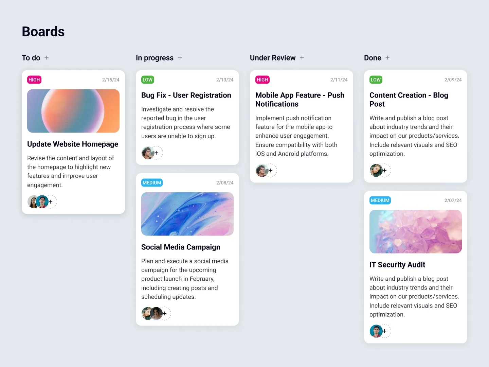

# Introduction
[100 FREE Frontend Challenges](https://dev.to/bigsondev/100-free-frontend-challenges-3f0?ref=dailydev)

## Diseño y funcionalidades
En este reto me centro en no solo crear el diseño si no que tambien añadir funcionalidades con React y otras librerias como react-beautiful-dnd para el drag and drop de las tareas, zustand para el manejo del estado global, react-icons. Las tareas estarán almacenadas en localStorage por medios de persit() de zustand.

### Task Board

